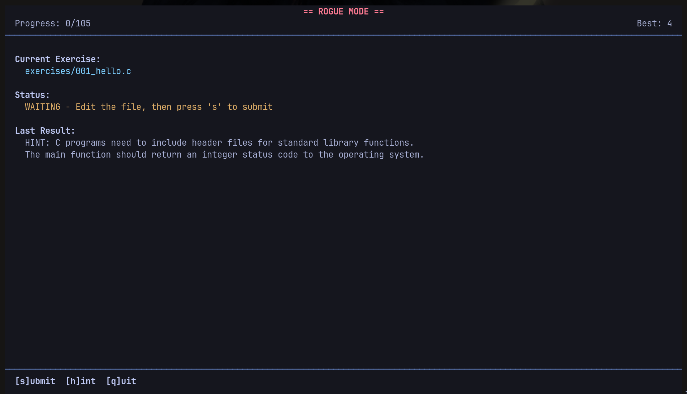

# Clings

Welcome to **Clings** - a series of tiny broken C programs that will teach you how to read and write C code!

Inspired by the brilliant [Ziglings](https://codeberg.org/ziglings/exercises) and [Rustlings](https://github.com/rust-lang/rustlings) projects.



## Interactive TUI

Clings features an interactive terminal UI with two game modes:

**Casual Mode** (default): Fix exercises at your own pace. Failed attempts let you retry immediately with full error output and hints.

```bash
make tui
```

**Rogue Mode**: Hardcore challenge mode. One mistake and you restart from exercise 1. Track your best run and compete with yourself.

```bash
make tui-rogue
```

Each mode tracks progress independently, so you can practice in casual mode while attempting rogue mode runs.

## Getting Started

### Prerequisites

- A C compiler (GCC or Clang recommended)
- Make
- ncurses library

On NixOS:
```bash
nix develop
```

### Installation

```bash
git clone <repository-url> clings
cd clings
```

### Usage

**Interactive Mode** (recommended):

```bash
make tui          # Casual mode - retry on failure
make tui-rogue    # Rogue mode - restart on failure
```

**Command-line Mode**:

```bash
make              # Run exercises sequentially until one fails
make run 5        # Run a specific exercise
make start 10     # Start from exercise 10 onwards
make hint         # Show hint for the current failing exercise
make rogue        # Rogue mode without TUI
```

## How It Works

Each exercise is a small C program with intentional bugs or missing code. Your job is to fix them!

**In TUI Mode**:
1. Press 's' to submit your solution
2. View errors and hints in the interface
3. Fix the code in your editor
4. Submit again until it passes
5. Automatically advance to the next exercise

**In Command-line Mode**:
1. Run `make` to start
2. Read the compilation errors or test failures
3. Open the exercise file and fix the problems
4. Run `make` again
5. Repeat until all exercises pass!

## Exercise Format

Each exercise contains:

- **Comments** explaining the concept being taught
- **Intentional bugs** for you to fix (marked with `TODO` or `FIX`)
- **Expected output** (as a comment: `// EXPECTED: ...`)
- **Hints** when you get stuck (as a comment: `// HINT: ...`)

Example:

```c
// Exercise 001: Hello World
// EXPECTED: Hello, Clings!
// HINT: Check the string in printf!

#include <stdio.h>

int main(void) {
    printf("Hello, World!\n");  // TODO: Fix this message
    return 0;
}
```

## What You'll Learn

Clings covers modern C (C99/C11) including:

- **Basics**: Variables, operators, control flow, functions
- **Pointers & Arrays**: Pointer arithmetic, arrays, strings
- **Memory Management**: malloc, free, memory leaks, valgrind
- **Structs & Unions**: Complex data types, alignment
- **File I/O**: Reading and writing files, error handling
- **Preprocessor**: Macros, conditional compilation
- **Standard Library**: Deep dive into stdlib, string.h, stdio.h
- **Security**: Buffer overflows, common vulnerabilities, best practices
- **Build Tools**: Makefiles, compilation flags, linking

## Philosophy

Like Ziglings, Clings aims to:

- Be self-contained and self-explanatory
- Teach by doing, not by reading
- Provide immediate feedback
- Make learning C fun and engaging
- Require no prior systems programming experience

## License

GPL

## Acknowledgments

- [Ziglings](https://codeberg.org/ziglings/exercises) by Dave Gauer
- [Rustlings](https://github.com/rust-lang/rustlings) by the Rust Team
- The C programming community

---

Ready to begin? Run `make` and start learning C.
